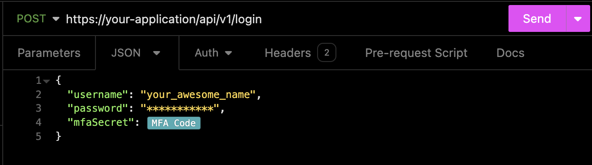
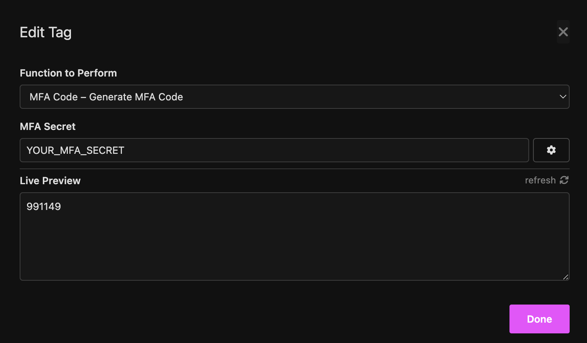
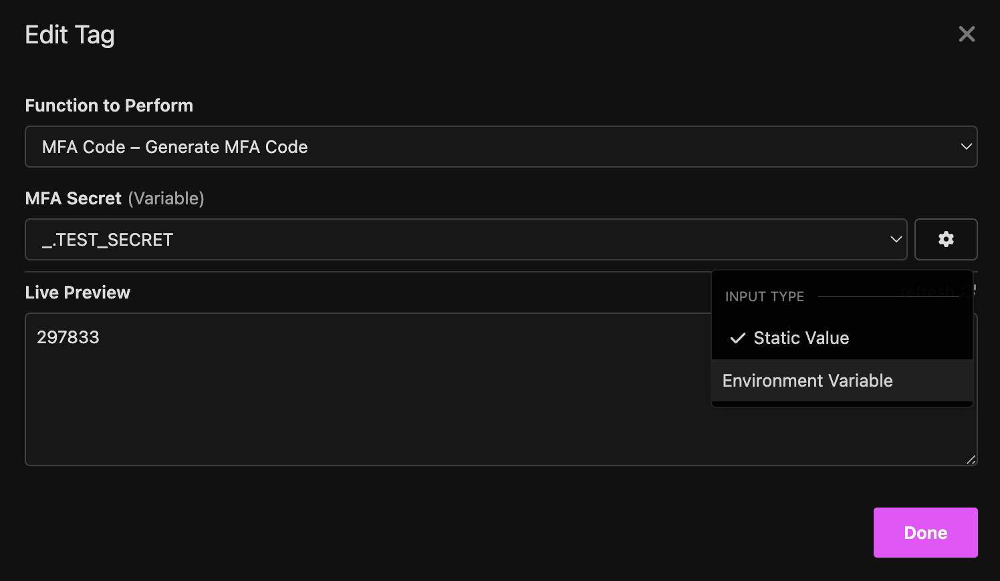

This is an [Insomnia](https://insomnia.rest/) plugin that allows you to generate MFA codes using [node-2fa](https://www.npmjs.com/package/node-2fa) under the hood.

## Installation

You can install this plugin manually by searching for its name, or you can automatically install it by visiting [this link](https://insomnia.rest/plugins/insomnia-plugin-mfa-authenticator) and clicking the `Install Plugin` button. This action will open the Insomnia application and install the plugin for you.

### Manual Installation

If you prefer to install the plugin manually, follow these steps:

1. Open Insomnia.
2. Go to Settings.
3. Open the Plugins Tab.
4. Type `insomnia-plugin-mfa-authenticator` in the input box and then click "Install Plugin".

## How to use the plugin?

This plugin provides Template Tags, similar to [environment variables](https://docs.insomnia.rest/insomnia/environment-variables/) in Insomnia.

Here's an example screenshot of a request payload. You can press `CTRL + Space` to use it just like an environment variable.

When updating the tag, you can use a static value for a single request.

Alternatively, you can link the value to an environment variable, allowing you to use the same value for multiple requests.

---

The flexibility is yours in how you choose to use it. Enjoy!.
